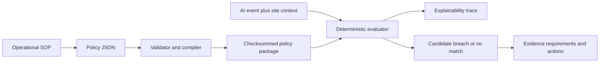

# Maspire Compliance Policy Compiler

> An explainable policy-as-code compiler and simulator for translating operational
> SOP requirements into deterministic, testable compliance rules.

[](https://github.com/OWNER/maspire-policy-compiler/actions/workflows/ci.yml)
[](LICENSE)
[](pyproject.toml)

AI models describe observations: “a person was detected with 0.93 confidence.”
They do not know whether that observation breaches a customer's SOP. This
demonstrator provides the missing policy layer. It compiles structured rules,
evaluates operational events and returns a complete explanation showing which
conditions matched, which failed and which evidence/actions are required.

## Innovation demonstrated

```text
Customer SOP
   ↓ structure as policy-as-code
Compiler validation + deterministic checksum
   ↓
AI event + site context
   ↓
Explainable condition tree
   ↓
Candidate breach + evidence requirements + actions
```

The system separates **AI observation** from **compliance judgement**. That
separation is important because the same camera detection may have different
meaning depending on zone, time, confidence, dwell duration, approved exception,
site procedure and policy version.

## Key capabilities

- Strongly validated JSON policy documents.
- Nested `all`, `any` and `not` condition groups.
- Safe declarative operators with no arbitrary code execution.
- Namespaced event fields and bounded policy depth.
- Deterministic SHA-256 checksum for each compiled policy version.
- Complexity output: referenced fields, node count and maximum depth.
- Explainable evaluation trace showing expected and actual values.
- Single-event and batch simulation with match-rate summary.
- Evidence requirements and response actions emitted only on a match.
- FastAPI/OpenAPI service, Docker image, CI workflow and tests.

## Architecture



## Policy example

```json
{
  "policy_id": "restricted-zone-entry",
  "version": "1.0",
  "name": "Forklift-only loading-zone entry",
  "description": "Flags a person entering the loading zone when no exception is active.",
  "severity": "high",
  "when": {
    "all": [
      {"field": "detection.class", "operator": "eq", "value": "person"},
      {"field": "event.zone", "operator": "eq", "value": "loading-zone"},
      {"field": "detection.confidence", "operator": "gte", "value": 0.85},
      {"field": "event.dwell_seconds", "operator": "gte", "value": 2},
      {
        "not": {
          "field": "context.approved_exception",
          "operator": "eq",
          "value": true
        }
      }
    ]
  },
  "evidence_requirements": ["two supporting frames", "reviewer decision"],
  "actions": ["queue-human-review", "notify-site-manager"]
}
```

## Explainability result

Each simulation produces a nested trace. For example:

```json
{
  "matched": true,
  "decision": "candidate_breach",
  "policy_checksum_sha256": "...",
  "trace": {
    "kind": "all",
    "matched": true,
    "summary": "5/5 conditions matched",
    "children": [
      {
        "kind": "condition",
        "field": "detection.confidence",
        "operator": "gte",
        "expected": 0.85,
        "actual": 0.93,
        "matched": true
      }
    ]
  }
}
```

This trace can be stored with the Evidence Object so a reviewer or auditor can
see exactly why the event was raised.

## Supported condition grammar

### Groups

| Construct | Meaning |
|---|---|
| `{"all": [...]}` | Every child must match |
| `{"any": [...]}` | At least one child must match |
| `{"not": {...}}` | Negates one child condition/group |

### Leaf operators

| Operator | Example | Meaning |
|---|---|---|
| `eq`, `ne` | zone equals `loading-zone` | Equality/inequality |
| `gt`, `gte`, `lt`, `lte` | confidence ≥ 0.85 | Ordered comparison |
| `in`, `not_in` | shift in `["PM", "night"]` | Membership |
| `contains` | detected labels contain `ppe` | Collection/string containment |
| `exists` | supervisor ID exists | Presence or absence |
| `between` | temperature between `[1, 5]` | Inclusive range |

Permitted field namespaces are `event.*`, `detection.*`, `site.*`, `camera.*`
and `context.*`. Unknown namespaces, unknown keys and unsupported operators fail
compilation rather than being ignored.

## Quick start

### Requirements

- Python 3.11+
- `pip`

### Install

```bash
git clone https://github.com/OWNER/maspire-policy-compiler.git
cd maspire-policy-compiler
python -m venv .venv
source .venv/bin/activate       # Windows: .venv\Scripts\activate
python -m pip install -e ".[dev]"
```

Replace `OWNER` in the badge and clone URL before publishing.

### Run the API

```bash
uvicorn app.main:app --reload --port 8001
```

- Swagger UI: <http://localhost:8001/docs>
- OpenAPI JSON: <http://localhost:8001/openapi.json>
- Health: <http://localhost:8001/health>

### Run the demonstration

```bash
python -m app.demo
```

The demonstration compiles the included restricted-zone policy, evaluates the
matching event and prints the complete explanation tree.

## API walkthrough

### Compile a policy

```bash
curl -sS -X POST http://localhost:8001/v1/policies/compile \
  -H 'Content-Type: application/json' \
  -d "{\"policy\": $(cat examples/restricted-zone-policy.json)}"
```

Compilation returns:

- canonical policy checksum;
- compiler version;
- fields referenced;
- condition-node count;
- maximum nesting depth;
- warnings for incomplete outputs.

### Simulate one event

```bash
curl -sS -X POST http://localhost:8001/v1/policies/simulate \
  -H 'Content-Type: application/json' \
  -d "{\"policy\": $(cat examples/restricted-zone-policy.json), \
       \"event\": $(cat examples/matching-event.json)}"
```

Use `examples/non-matching-event.json` to see multiple failing trace nodes.

### Batch simulation

```bash
curl -sS -X POST http://localhost:8001/v1/policies/batch-simulate \
  -H 'Content-Type: application/json' \
  -d "{\"policy\": $(cat examples/restricted-zone-policy.json), \
       \"events\": [$(cat examples/matching-event.json), \
                     $(cat examples/non-matching-event.json)]}"
```

The response includes total events, matches, match rate and an explanation for
every event. This supports pre-deployment policy calibration against labelled
clips or synthetic events.

## Deterministic policy checksum

The compiler serializes the validated policy as canonical JSON—sorted keys,
compact separators and UTF-8—then calculates SHA-256. Reordering JSON object
keys therefore does not change policy identity, while changing a threshold,
condition, action or version does.

The checksum can link:

- the policy approved by a customer;
- the policy used for an event;
- the simulation results reviewed before deployment;
- the rule version recorded inside an Evidence Object.

In production, a checksum should be combined with signed policy packages,
approved release records and protected storage.

## Safety design

The DSL does not evaluate Python expressions and does not support:

- arbitrary code or imports;
- calls to external services;
- user-defined functions;
- regular expressions;
- mutation of the submitted event;
- silent acceptance of unknown fields/operators.

The compiler also calculates policy depth and node count. A production service
should enforce tenant-specific size/rate quotas in addition to these controls.

## Tests

```bash
pytest --cov=app --cov-report=term-missing
ruff check app tests
```

The suite covers stable checksums, compiler errors, every supported operator,
nested Boolean logic, missing data, matching and non-matching explanation traces,
single-event API simulation and batch match rates.

## Docker

```bash
docker compose up --build
```

The service is exposed at <http://localhost:8001> and runs as an unprivileged
container user.

## Repository structure

```text
.
├── app/
│   ├── canonical.py       # canonical JSON and policy checksum
│   ├── compiler.py        # safe DSL validation and inspection
│   ├── evaluator.py       # deterministic evaluation and traces
│   ├── schemas.py         # typed API and result models
│   ├── main.py            # FastAPI endpoints
│   └── demo.py            # executable example
├── examples/
│   ├── restricted-zone-policy.json
│   ├── matching-event.json
│   └── non-matching-event.json
├── tests/
├── .github/workflows/ci.yml
├── Dockerfile
├── docker-compose.yml
└── README.md
```

## Production roadmap

1. Persist tenant-specific policies and immutable version history.
2. Add draft, review, approval, canary and rollback states.
3. Sign compiled policy packages and verify signatures at the edge.
4. Add site timezone, schedule and duration primitives.
5. Add policy simulation against labelled video-event datasets.
6. Link policy checksum and explanation trace to Evidence Objects.
7. Add OIDC/RBAC, audit logging, quotas and observability.
8. Add a visual no-code rule builder that emits this same safe DSL.

## GitHub publication checklist

- [ ] Replace `OWNER` placeholders.
- [ ] Confirm the repository name and Apache-2.0 licence.
- [ ] Add a private security-reporting contact.
- [ ] Enable branch protection, CI, secret scanning and dependency alerts.
- [ ] Add a screenshot or GIF of Swagger and the explanation trace.
- [ ] Review all example policies to ensure they contain no customer data.
- [ ] Tag `v0.1.0` only after CI passes on GitHub.

## Important limitations

This is a technical demonstrator, not legal advice or a certified compliance
decision system. A matched policy means the submitted event data satisfied the
configured conditions. It does not establish that the event was true, that an AI
model was accurate, that the policy correctly represents law or that processing
was lawful. Material outcomes require validated inputs, approved policies and
human review.

## Licence

Apache License 2.0. See [LICENSE](LICENSE).

